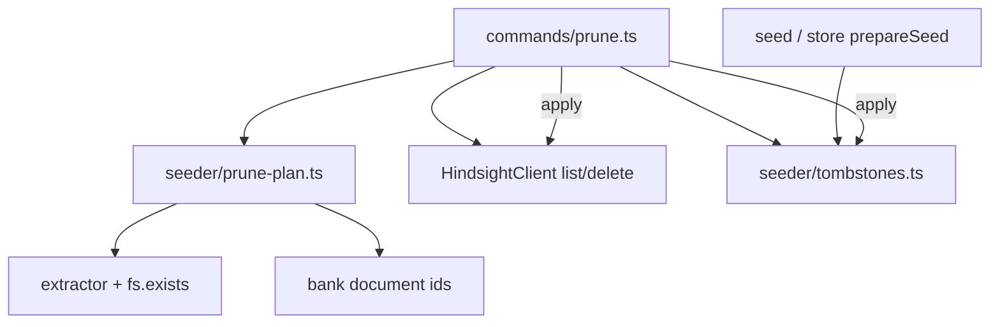

# nocciolo prune (issue #59)

Branch: `59-nocciolo-prune-bank-hygiene`. Scope is Phase 4 path-gone / section-gone / explicit delete + tombstones. No `--judge jev`, no separate `docs` subcommands, no zanuka-web patches.

## Locked design choices

- **Delete documents** via `DELETE /v1/default/banks/{bankId}/documents/{documentId}` (cascades linked memories). Do not use `clear_memories` or bank delete. Soft `invalidate_memory` is out of scope.
- **Tombstones** live in a new gitignored file [`.nocciolo/local/tombstones.json`](.nocciolo/local/) (do not bump seed-manifest schema). Schema: `{ version: 1, bankId, updatedAt, entries: { [documentId]: { sourcePath?, contentHash?, prunedAt } } }`.
- **Tombstone skip** in [`prepareSeed`](src/seeder/prepare.ts) (shared by seed and store): after extract, drop facts whose `id` is tombstoned when `!force` and current `contentHash` equals the tombstone’s `contentHash` (missing file / missing hash also keeps the skip). Content hash change or `--force` allows re-retain; clear matching tombstone entries after a successful retain of that id.
- **`--dry-run`** may call `listDocuments` (read-only) but never delete or write tombstones. Mutating apply requires TTY confirm or `--source`/`--document-id` + `--yes` (docker-upgrade style, not store’s quiet non-TTY default).
- **No thin `nocciolo docs list/delete` in this PR.** Scripted parity is `prune --document-id … --yes` and `prune --dry-run`. Full bank inventory for humans is the dry-run candidate list plus explicit selection.

## Architecture

| Layer | New / touch |
|-------|-------------|
| HTTP | [`src/providers/hindsight/client.ts`](src/providers/hindsight/client.ts): `listDocuments` (paginate `limit`/`offset` until exhausted), `deleteDocument` |
| Planner | `src/seeder/prune-plan.ts` (pure grouping) |
| Tombstones | `src/seeder/tombstones.ts` load/save/filter helpers |
| Retain hook | [`src/seeder/prepare.ts`](src/seeder/prepare.ts) + clear tombstones after retain in seed/store path |
| Command | `src/commands/prune.ts` + wire in [`src/cli.ts`](src/cli.ts) |
| Docs | CLI reference, ROADMAP Phase 4 prune checkbox, short retiring-seeder note; update cli-architecture table |

## Planner rules (v1 groups)

Parse bank `document_id`s:

1. **`nocciolo:<relPath>#<section>`**  
   - File missing on disk → **path-gone**  
   - File present but current `extractFromSource` no longer emits that id → **section-gone**  
   - File present and id still extracted → not a candidate (unless explicit)

2. **Legacy bare path ids** (e.g. `docs/foo.md`)  
   - File missing → **path-gone**  
   - File still present → **not** auto-candidate (operator must pass `--document-id` / `--source`). Never treat `nocciolo:…` as stale merely because it is not a bare path.

3. **Explicit**  
   - `--document-id`: that id only  
   - `--source <path>`: all bank docs whose source is that path (bare id equal to path, or `nocciolo:<path>#…`)

Path checks use filesystem existence under project root. Section re-extract runs on the file when present (not limited to scanner include), so excluded-tree orphans can still be pruned when selected or path-gone. Do not mass-select every `nocciolo:` id.

## CLI UX

Flags: `--dry-run`, `--source`, `--document-id`, `-y/--yes`, `--hindsight-url`, `--api-key`.

| Mode | Behavior |
|------|----------|
| `--dry-run` | Print groups + stable ids + provenance; no mutate |
| TTY, no selection flags | Multi-select over candidates (`promptMultiSelect`), then confirm |
| Non-TTY without `--yes` + selection | `NoccioloError` with hint to dry-run then `--document-id`/`--source` + `--yes` |
| `--yes` without `--source`/`--document-id` | Refuse |
| Apply | `deleteDocument` per selected id; write tombstones; recommend mental-model refresh in copy only (no auto-refresh) |

Connection resolution: same as seed (`resolveHindsightBaseUrl` / `resolveHindsightApiKey`).

## Tests

- `client.test.ts`: list URL/query/pagination + delete encoding of `nocciolo:path#slug`; error paths  
- `prune-plan.test.ts`: path-gone, section-gone, legacy path still on disk not auto-stale, no mass false-positive on `nocciolo:`, `--source` expands to section + path ids  
- Tombstone + `prepareSeed`: pruned id skipped when hash matches; re-retain after hash change or `--force`  
- Command-level dry-run / refuse non-interactive without selection (mock client), patterned on existing command tests

## Docs / roadmap

- Promote [`docs/nocciolo-cli-commands.md`](docs/nocciolo-cli-commands.md) prune section from “coming soon” to shipped behavior  
- Short “retiring a custom seeder” note (list candidates → dry-run → selective delete; coexist with path ids) in that doc or [`docs/phase-5-dogfood-gaps.md`](docs/phase-5-dogfood-gaps.md)  
- Check Phase 4 prune item in [`ROADMAP.md`](ROADMAP.md); leave Phase 5 “list/delete helpers” open if not shipping `docs` subcommands  
- Update [`docs/cli-architecture.md`](docs/cli-architecture.md) module table + mermaid for prune  
- Markdown style: no em/en dashes as punctuation

## Implementation order

1. Client list/delete + unit tests  
2. Tombstones module + `prepareSeed` filter + clear-on-retain  
3. Pure planner + tests  
4. `runPrune` command + `cli.ts` wiring  
5. Docs / ROADMAP  
6. `pnpm test` (or repo test script) green on the feature branch

## Out of scope

Jev/`--judge jev`, Firstmate watcher auto-prune, full-bank wipe, multi-provider, mental-model auto-refresh, zanuka-web dogfood patches.
