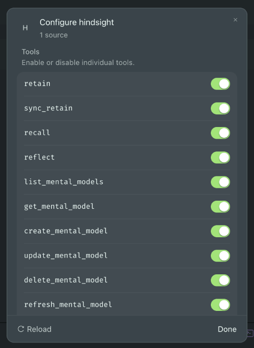

# Nocciolo


**Company brain config for AI agents.**

Nocciolo (Italian for kernel / core): the durable core of project knowledge that agents inherit.

## Goal

Seed [Hindsight](https://hindsight.vectorize.io/) memory banks from durable project docs, ADRs, and decisions so agents inherit shared context instead of rediscovering it every session.

[](LICENSE)
[]()

---

## The Problem

AI coding agents start every session cold.

They re-learn architecture decisions, coding standards, domain invariants, and “why we built it this way” from scattered READMEs, ADRs, comments, and tribal knowledge. That wastes tokens, produces inconsistent output, and breaks long-running agentic workflows.

Traditional documentation is written for humans. Agent memory systems need structured, durable, queryable knowledge with clear missions and boundaries.

## The Vision

Nocciolo is the **company brain config** layer.

It turns the durable knowledge already living in your repository into a properly configured memory bank that agents can retain, recall, and reflect against: starting with [Hindsight](https://hindsight.vectorize.io).

Agents inherit shared context instead of rediscovering it.

## What Nocciolo Does

- **Scans** your project for durable knowledge (READMEs, ADRs, standards, domain docs, schemas)
- **Configures** a Hindsight memory bank with a clear mission, directives, and extraction settings tuned for software projects
- **Seeds** the bank with high-signal facts and decisions via Hindsight **retain**: not by uploading raw markdown like a file-sync script
- **Emits** the configs and MCP snippets needed to wire the bank into Cursor, Claude Code, Roo, and other agent harnesses
- **Shares** knowledgebases across teams with explicit deployment profiles: local/LAN, VPN, public self-host, or [Hindsight Cloud](https://docs.hindsight.vectorize.io/): so the company brain reaches the agents that need it
- **Stays local-first**: self-host by default; Cloud is opt-in, never required

Hindsight is the first-class target ([retain / recall / reflect](https://hindsight.vectorize.io/), observations, mental models, bank templates). Host it yourself with Docker or use [Hindsight Cloud](https://docs.hindsight.vectorize.io/) when you want managed infra (same Nocciolo seed/MCP flow: see [docs/hindsight-cloud.md](./docs/hindsight-cloud.md)). Other memory backends stay optional and later: only if real demand appears. Event-driven updates, richer curation, and team-wide sharing are on the [roadmap](./ROADMAP.md).

## Quick Start

### Use from another local project

The CLI is not published yet. From a Nocciolo clone, put `nocciolo` on your PATH, then `cd` into the other repo and run it there (it uses the current working directory):

```bash
# once, in the Nocciolo clone
pnpm install && pnpm build
npm link                               # symlinks `nocciolo` into your Node bin dir

# then, in any other project (e.g. Strumentario)
cd /path/to/your-project
nocciolo --help
nocciolo init                          # scaffold .nocciolo/ (prompts for bank id + Docker container)
nocciolo configure                     # generate Hindsight bank template
nocciolo seed --dry-run                # preview candidates (no API calls)
nocciolo seed                          # retain
nocciolo mcp --write --write-agents --write-cursor-rules --include-auth
```

`pnpm nocciolo …` only works **inside this repo**. Other projects need the linked `nocciolo` binary (or the clone path below). `npm link` needs no extra setup. To link with pnpm instead, run `pnpm setup` once (it creates `PNPM_HOME` and adds it to your PATH), open a new shell, then `pnpm link --global`: without that step pnpm fails with `ERR_PNPM_NO_GLOBAL_BIN_DIR`.

Without linking, invoke the clone’s bin from the other project:

```bash
cd /path/to/your-project
/path/to/nocciolo/bin/nocciolo.js --help
```

Once published to npm:

```bash
npm install -g @nocciolo-ai/cli        # or: npx @nocciolo-ai/cli …
nocciolo init
```

Developing **inside this repo** (no global install required):

```bash
pnpm install && pnpm build             # install deps and build the CLI
pnpm nocciolo init                     # scaffold .nocciolo/ (prompts for bank id + Docker container)
pnpm nocciolo configure                # generate Hindsight bank template
pnpm nocciolo seed --dry-run           # preview candidates (no API calls)
pnpm nocciolo seed                     # retain (no auth)
pnpm nocciolo docker print             # local Hindsight docker command
pnpm nocciolo mcp                      # print MCP snippets
pnpm nocciolo mcp --write --write-agents --write-cursor-rules --include-auth --dry-run
```

`init` asks for a **bank id** (project-specific) and a **Docker container name** (shared Hindsight server: one container can host many banks). Non-interactive: `--bank-id`, `--container-name`, and `--yes`. Defaults: slug of the project directory for the bank id; container `hindsight`.
When your Hindsight bank requires auth (typical for Docker with `HINDSIGHT_API_TENANT_API_KEY`), pass the **same secret value** into Nocciolo on live `seed` only: `--dry-run`, `init`, and `configure` do not need it:

```bash
# Global install (linked clone or published package)
NOCCIOLO_HINDSIGHT_API_KEY='your-actual-key' nocciolo seed

# Developing this repo without a global install
NOCCIOLO_HINDSIGHT_API_KEY='your-actual-key' pnpm nocciolo seed

# Or export once for the shell session
export NOCCIOLO_HINDSIGHT_API_KEY='your-actual-key'
nocciolo seed

# Or pass the flag
nocciolo seed --api-key 'your-actual-key'

# Optional: read the key from a running Hindsight container (name from init / config; default hindsight)
NOCCIOLO_HINDSIGHT_API_KEY="$(docker exec hindsight printenv HINDSIGHT_API_TENANT_API_KEY)" \
  nocciolo seed
```

Requires Node.js 20+. Point at a custom Hindsight URL with `--hindsight-url`, `NOCCIOLO_HINDSIGHT_URL`, or `hindsightBaseUrl` in `.nocciolo/config.json`. `HINDSIGHT_API_KEY` is accepted as an alias for `NOCCIOLO_HINDSIGHT_API_KEY`.

The goal is a zero-to-useful bank in under five minutes.

## Seeding with `nocciolo seed`

`seed` is the heart of the workflow: curated retain into Hindsight: not a bulk markdown upload. There is **no separate sync command**; when docs change, run `nocciolo seed` again (preview with `--dry-run` first).

### Not a file-sync / upload script

Many Hindsight setups use a script that **uploads markdown files** into the bank as a document corpus: re-processing the whole tree on every run. Nocciolo works differently:

| File-sync / upload scripts | Nocciolo `seed` |
|----------------------------|-----------------|
| Upload raw `.md` files into Hindsight | Extract **high-signal sections** locally (heuristic, conservative) |
| Bank holds a mirror of the doc tree | Bank holds **structured memories** (facts, entities, links) via Hindsight **retain** |
| Re-upload often re-processes everything | **Incremental**: unchanged sources are skipped using content hashes in `.nocciolo/local/seed-manifest.json` |
| Opaque file ids | Stable `document_id`s (`nocciolo:<path>#<section>`) so Hindsight **upserts** instead of duplicating |

**Why retain instead of upload**

- **Agent-native recall**: structured facts, entities, and links for `recall` / `reflect`, not a searchable copy of your `.md` tree
- **Less noise**: conservative extraction skips boilerplate (TOCs, changelogs) and denies secrets before retain
- **Incremental updates**: content hashes skip unchanged sources; only new or edited docs hit Hindsight
- **Stable upserts**: same path + section → same `document_id`; edits update memories instead of duplicating them
- **Provenance**: each fact carries source path, kind, and optional git commit
- **Preview before retain**: `--dry-run` lists candidates and skips with no API calls
- **Clear separation**: bank template (mission/directives) vs seed (project facts); additive, never wipes the bank

Full rationale for contributors: [docs/nocciolo-sync-strategy.md](./docs/nocciolo-sync-strategy.md).

What `seed` actually does:

1. Scan durable sources locally (README, AGENTS.md, `docs/**`, ADRs: secrets like `.env` excluded)
2. Extract scored candidate facts with provenance (source path + optional git commit)
3. **Retain** each candidate via Hindsight’s memories API (LLM extraction per item)
4. Write incremental state to `.nocciolo/local/seed-manifest.json` (gitignored, machine-local)

Hindsight then runs **consolidation** in the background (observations / mental models). That is expected and usually much faster than re-uploading whole files.

Every `seed` run **reads all durable sources locally** (to compute hashes), but only **new or changed** files are sent to Hindsight unless you pass `--force`. A successful **live** `seed` writes the manifest; `--dry-run` previews only and does not update it: so the first live seed after dry-run only establishes incremental state once retain completes.

**Preview first**

```bash
pnpm nocciolo seed --dry-run
```

Shows scored candidates from durable docs (README, AGENTS.md, docs, ADRs), with provenance and skips for empty or low-signal sections. No API calls.

**Retain with clear progress**

```bash
NOCCIOLO_HINDSIGHT_API_KEY='your-key' pnpm nocciolo seed
```

Before retain starts you will see a warning like this: leave the terminal open until Nocciolo finishes:

```text
============================================================
Hindsight is processing retain requests.
Do not close this terminal or press Ctrl+C until Nocciolo reports completion.
Sync mode: 28 item(s); each can take several seconds. Progress shows as percent of items.
Interrupting mid-retain can leave a partial bank; re-run seed (use --force if needed).
============================================================
```

Then progress lines appear as each candidate is retained:

```text
Retaining 28 item(s) synchronously (LLM extraction per item).
Progress:
  [1/28] 0%  starting  nocciolo:README.md#the-problem
  [1/28] 4%  done      nocciolo:README.md#the-problem
  ...
```

A full first seed can take several minutes (LLM extraction per item). That is expected, not a hang.

- Uses stable `document_id`s so Hindsight **upserts** a document’s memories instead of dumping duplicate files into the bank
- Skips secrets and noise (`.env`, credentials, etc.): see [sensitive data](./docs/sensitive-data.md)
- Auth failures stop early (pass `NOCCIOLO_HINDSIGHT_API_KEY` or `--api-key`)

**Re-seed only what changed**

After a successful live seed, re-running `seed` compares each source’s content hash to `.nocciolo/local/seed-manifest.json`. Unchanged files appear under “Skipped N unchanged source(s)” in the plan output and are not retained again. Changed or new files are re-retained with the same `document_id` when the path and section slug match, so Hindsight upserts them. The bank is not wiped.

If incremental skip is not working (everything is retained again), check that `.nocciolo/local/seed-manifest.json` exists on this machine: it is gitignored and is not shared via git. A first live seed, a failed/interrupted seed, or seeding on a fresh clone all behave like a full retain until the manifest is written.

```bash
pnpm nocciolo seed --dry-run          # see what would update vs skip as unchanged
pnpm nocciolo seed                    # incremental retain (only new/changed sources)
pnpm nocciolo seed --force            # re-retain all current candidates
pnpm nocciolo seed --async            # submit + poll Hindsight operation progress
```

There is no `nocciolo prune` (or unseed / invalidate) command. Seed is additive.

If you **edit** a durable file in place, re-run `nocciolo seed`. That is enough: same path → same `document_id` → upsert.

If you **rename or delete** a source (for example `docs/foo.md` → `docs/bar.md`), re-run `nocciolo seed` to retain the new path. That does **not** remove memories from the old path. Those stay in the bank under the old ids (`nocciolo:docs/foo.md#…`). `--force` does not fix this. Invalidate or delete those stale documents in Hindsight (Control Plane or MCP `invalidate_memory` / `delete_document`) if the duplicates matter.

Here is the Nocciolo bank’s world-facts constellation in Hindsight after a `seed`: structured memories and links agents can recall, not a dump of raw markdown files:


More detail: [developer workflow](./docs/dev-workflow.md), [sync strategy](./docs/nocciolo-sync-strategy.md).

## Local Hindsight & agent wiring

Default path: run Hindsight yourself (Docker). For managed hosting, see [Hindsight Cloud](#hindsight-cloud-opt-in) below and [docs/hindsight-cloud.md](./docs/hindsight-cloud.md).

```bash
pnpm nocciolo docker print             # print docker run (no execute)
pnpm nocciolo docker up                # start local Hindsight (needs Docker + LLM key)
pnpm nocciolo docker status
pnpm nocciolo docker down

pnpm nocciolo mcp                      # print snippets for all harnesses
pnpm nocciolo mcp --write --write-agents --write-cursor-rules --include-auth
```

After `nocciolo mcp --write ...`, a successful Hindsight MCP connection in Cursor shows your bank with memory tools enabled:



Single-bank MCP URL shape: `http://localhost:8888/mcp/<bankId>/`. LLM key for Docker: `--llm-api-key` or `OPENAI_API_KEY` / `HINDSIGHT_API_LLM_API_KEY`. Tenant auth on the container: `--api-key` (same value as `NOCCIOLO_HINDSIGHT_API_KEY` for seed/MCP).

Hindsight **retain** (what `nocciolo seed` calls) needs a working LLM. If your Hindsight instance is configured for **Ollama**, that process must be running and reachable from the Hindsight container before you seed: otherwise retain returns `500` with errors like `ConnectError: All connection attempts failed` / `Fact extraction failed`. Start Ollama (`ollama serve`), ensure the model is pulled, and use a base URL the container can reach (often `host.docker.internal`, not `localhost`). Cloud providers (e.g. OpenAI via `HINDSIGHT_API_LLM_API_KEY`) do not need Ollama.

### Hindsight Cloud (opt-in)

Skip local Docker and point Nocciolo at [Hindsight Cloud](https://docs.hindsight.vectorize.io/): same `configure` / `seed` / `mcp` commands, managed API at `https://api.hindsight.vectorize.io`. Create an org and API key in the [Cloud console](https://ui.hindsight.vectorize.io); free credits and a short course are on [Hindsight Academy](https://learn.hindsight.vectorize.io/).

```bash
export NOCCIOLO_HINDSIGHT_URL=https://api.hindsight.vectorize.io
export NOCCIOLO_HINDSIGHT_API_KEY=hsk_…   # from Cloud → Connect → Create API Key

nocciolo seed --dry-run
nocciolo seed
nocciolo mcp --hindsight-url https://api.hindsight.vectorize.io --include-auth --write
```

Interactive IDEs can also use Cloud’s OAuth MCP host (`https://mcp.hindsight.vectorize.io`) instead of pasting a key: details and trade-offs in [docs/hindsight-cloud.md](./docs/hindsight-cloud.md). First-class `hindsight-cloud` deployment profile lands in Phase 4 ([ROADMAP](./ROADMAP.md)).

### `nocciolo mcp` options

By default `mcp` **prints** ready-to-paste configs. It does not detect your IDE: use write flags for the files you want.

| Flag | What it does |
|------|----------------|
| *(none)* | Print snippets for Cursor, Claude Code, Claude Desktop, Roo, Codex, and Kiro |
| `--harness <list>` | Limit output: `cursor`, `claude-code`, `claude-desktop`, `roo`, `codex`, `kiro`, or `all` (comma-separated) |
| `--write` | Write/merge project `.cursor/mcp.json` |
| `--write-roo` | Write/merge project `.roo/mcp.json` (`type: streamable-http`) |
| `--write-kiro` | Write/merge project `.kiro/settings/mcp.json` |
| `--write-agents` | Upsert an `AGENTS.md` section telling agents to prefer the project bank |
| `--write-cursor-rules` | Write `.cursor/rules/hindsight-bank.mdc` (`alwaysApply: true`) |
| `--dry-run` | Preview writes without touching the filesystem (requires at least one `--write*` flag) |
| `--force` | Overwrite an existing `hindsight` MCP entry or Cursor rule file |
| `--hindsight-url <url>` | Override Hindsight base URL for the MCP endpoint |
| `--include-auth` | Add `Authorization` headers; written files use env placeholders (`${env:NOCCIOLO_HINDSIGHT_API_KEY}` for Cursor) |
| `--api-key <key>` | Include this key **literally** in printed snippets only; file writes still use env placeholders |

Examples:

```bash
pnpm nocciolo mcp --harness cursor,claude-code
pnpm nocciolo mcp --write --dry-run
pnpm nocciolo mcp --write --include-auth
pnpm nocciolo mcp --write-roo --write-kiro --dry-run
pnpm nocciolo mcp --write --write-agents --write-cursor-rules --force
pnpm nocciolo mcp --hindsight-url http://127.0.0.1:8888 --include-auth
```

## Docs

- [Sync strategy](./docs/nocciolo-sync-strategy.md): why Nocciolo uses curated retain instead of markdown file upload
- [Knowledge-base configs](./docs/nocciolo-configs.md): `.nocciolo/` files, bank template, seed manifest, and MCP recall
- [CLI architecture](./docs/cli-architecture.md): module boundaries, seed pipeline, config, and env/auth for contributors
- [Developer workflow](./docs/dev-workflow.md): build, first seed, re-seed, and Hindsight retain/consolidation tips
- [Developer testing](./docs/dev-testing.md): end-user command sequence and E2E regression checklist
- [Hindsight Cloud](./docs/hindsight-cloud.md): opt-in managed hosting vs local Docker; profiles, auth, MCP
- [Hindsight bank backup](./docs/hindsight-bank-backup.md): Docker `hindsight-admin` full backup and per-bank export
- [Hindsight upgrade](./docs/hindsight-upgrade.md): upgrade the local Docker image while keeping the data volume
- [Hindsight mental models](./docs/hindsight-mental-models.md): curated reflect, tagging, configure wizard, post-seed CLI
- [Phase 4 dogfood gaps](./docs/phase-4-dogfood-gaps.md): Strumentario lessons: multi-repo MCP, template apply, shareable config
- [Sensitive data](./docs/sensitive-data.md): allowlist/denylist decisions so secrets never get retained

## Core Principles

- **Durable over ephemeral**: only knowledge that should outlive a single session or model change
- **Local control**: self-hostable by default; [Hindsight Cloud](https://docs.hindsight.vectorize.io/) is opt-in, never required
- **Agent-native**: missions, directives, and structure that map cleanly to how modern memory systems actually work
- **Traditional craft first**: clear architecture, ADRs, and standards remain the source of truth; Nocciolo amplifies them for agents
- **Progressive**: start simple (single bank, one project), grow into multi-bank, multi-repo, team sharing, and event-driven workflows
- **Share on your terms**: local/LAN, VPN, public self-host, or Hindsight Cloud when managed hosting fits the team

## Status

Nocciolo is in the earliest public stage. We are building in the open.

See [ROADMAP.md](./ROADMAP.md) for the high-level phased plan.

## Contributing

Issues, ideas, and PRs are welcome once the foundation lands. For now the best way to help is feedback on the vision and the initial CLI surface.

## Author

Created by [zanuka](https://github.com/zanuka) (Mike Delucchi)

## License

Copyright © 2026 Mike Delucchi. Released under the [MIT License](LICENSE).

