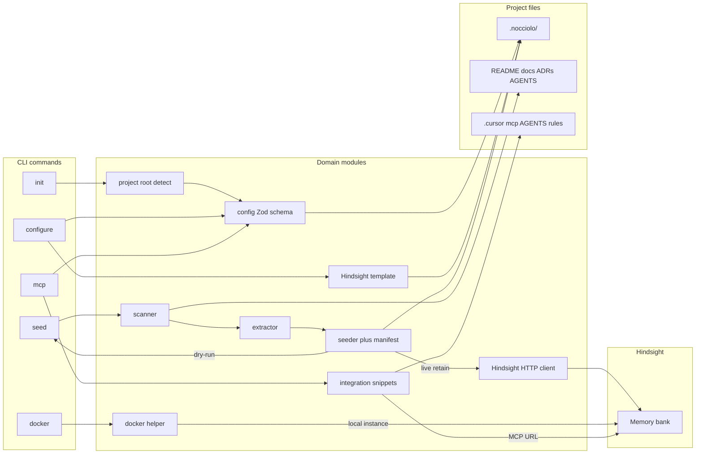
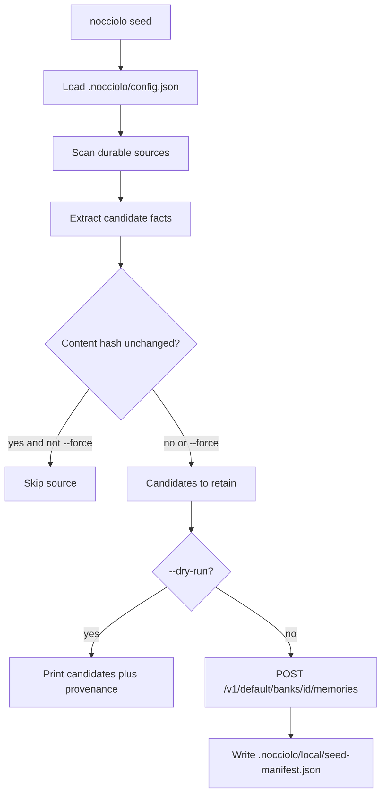

# Nocciolo CLI Architecture

Contributor guide to how the CLI is structured and how the main commands work. Read this alongside [AGENTS.md](../AGENTS.md) and [ROADMAP.md](../ROADMAP.md).

## Mental model

Nocciolo turns **durable project knowledge** already in a repo into a configured [Hindsight](https://hindsight.vectorize.io) memory bank so coding agents inherit shared context.

It is **not** a general multi-agent orchestrator. It is a local-first config + curation CLI with clear stage boundaries:

1. Discover durable sources (scanner)
2. Extract high-signal candidates (extractor)
3. Generate bank templates (provider template)
4. Retain into the memory system (seeder), driven by `seed` (bootstrap scan) or `store` (ongoing operator-selected subset; same retain path)
5. Emit agent integration snippets (MCP configs, optional AGENTS.md / Cursor rules, Firstmate `project-bank` skill)

Prefer missing a weak fact over injecting noise.

## Architecture overview



### Seed pipeline detail



## Source layout

| Path | Responsibility |
|------|----------------|
| `src/cli.ts` | Commander entry: wires commands and flags |
| `src/commands/` | Command orchestration + user-facing output |
| `src/project/` | Project root detection, git commit lookup, worktree detection, captain-home registry |
| `src/config/` | Paths, Zod schema, load/save `.nocciolo/config.json` (including `store.allowlist`) |
| `src/scanner/` | Find durable docs (README, AGENTS.md, docs/**, ADRs); `store`'s stricter denylist |
| `src/extractor/` | Conservative heuristics → candidate facts + provenance |
| `src/providers/hindsight/` | Bank template types/generator + HTTP retain client |
| `src/seeder/` | Prepare retain payload, incremental manifest (shared by `seed` and `store`) |
| `src/integration/` | MCP URL + harness snippets + AGENTS/Cursor rule emitters + Firstmate `project-bank` skill |
| `src/docker/` | Local Hindsight Docker run/stop/status plans |
| `src/utils/` | Shared FS helpers and actionable errors |

Keep these boundaries. Do not collapse scan → extract → retain into one opaque function. Integration emission stays separate from seeding.

## Happy path commands

```bash
pnpm install && pnpm build
node dist/cli.js init
node dist/cli.js configure
node dist/cli.js docker print
node dist/cli.js seed --dry-run
node dist/cli.js seed
node dist/cli.js store --dry-run
node dist/cli.js store --yes
node dist/cli.js mcp
node dist/cli.js mcp --write --dry-run
```

| Command | What it does |
|---------|----------------|
| `init` | Detect project root; prompt (or flags) for bank id + Docker container; write `.nocciolo/config.json` |
| `configure` | Generate Hindsight bank template under `.nocciolo/hindsight/` |
| `docker` | Print or run a local Hindsight container (`up` / `down` / `status` / `print` / `upgrade`) |
| `seed --dry-run` | Scan + extract; print candidates; **no** API calls |
| `seed` | Retain candidates into Hindsight; update local seed manifest |
| `store --dry-run` | Print known/new/changed/unchanged buckets for allowlisted + discovered markdown; **no** API calls |
| `store` | Retain an operator-selected subset (allowlist, `--files`, or interactive pick) via the same seed retain path |
| `mcp` | Print ready-to-paste MCP snippets; optional `--write` / AGENTS / Cursor rules / Firstmate `project-bank` skill |

Common flags:

- `--dry-run`: preview without mutating (or without calling Hindsight for seed)
- `--force`: overwrite config/template/MCP entry, or re-seed unchanged sources
- `--yes` / `-y`: on `init`, accept defaults without interactive prompts
- `--bank-id <id>`: Hindsight bank id on `init` (project-specific; many banks can share one server)
- `--container-name <name>`: local Docker container on `init` (shared Hindsight server)
- `--hindsight-url <url>`: override Hindsight base URL for this run
- `--api-key <key>`: override API key for this run (seed) or enable tenant auth (docker) / print auth snippets (mcp)
- `--async`: submit retain asynchronously to Hindsight

## Config and generated files

Version-controlled (commit these):

```text
.nocciolo/
  config.json                 # project name, bankId, provider, optional hindsightBaseUrl + docker
  hindsight/
    bank-template.json        # importable Hindsight bank template (version "1")
```

Local / gitignored state (do **not** commit secrets or machine-local seed state):

```text
.nocciolo/
  local/
    seed-manifest.json        # content hashes + fact ids for incremental seed
  cache/
```

`config.json` keeps `root: "."` (portable). Bank id defaults to a slug of the project name (directory name), never hardcoded to `nocciolo`.

Optional config fields:

- `hindsightBaseUrl`: default Hindsight server for this project (still overridable by env/CLI)
- `docker.containerName` / `docker.volumeName`: local Docker helper defaults (shared server; not 1:1 with `bankId`)

**Never** put API keys in version-controlled config. Use env vars or `--api-key`.

## Environment variables and shell one-liners

### Resolution order

**Base URL**

1. `--hindsight-url`
2. `hindsightBaseUrl` in `.nocciolo/config.json`
3. `NOCCIOLO_HINDSIGHT_URL` or `HINDSIGHT_URL`
4. Default: `http://localhost:8888`

**API key**

1. `--api-key`
2. `NOCCIOLO_HINDSIGHT_API_KEY` or `HINDSIGHT_API_KEY`
3. Omit header if unset (fine for unauthenticated local servers)

Live retain sends `Authorization: Bearer <key>` when a key is present.

### Prefixed env assignment

```bash
NOCCIOLO_HINDSIGHT_API_KEY=your-real-key node dist/cli.js seed
```

This is **shell** syntax, not a Node-specific feature:

1. The shell sets `NOCCIOLO_HINDSIGHT_API_KEY` only for the following process.
2. `node dist/cli.js seed` inherits that environment.
3. When the process exits, your interactive shell is unchanged (unless you previously `export`ed the variable).

Equivalents:

```bash
# persistent for the current shell session
export NOCCIOLO_HINDSIGHT_API_KEY=your-real-key
node dist/cli.js seed

# flag instead of env
node dist/cli.js seed --api-key your-real-key

# dry-run never needs a key
node dist/cli.js seed --dry-run
```

If Hindsight returns `401`/`403`, the CLI hints that an API key may be required.

## Scanner: what counts as durable

Conservative first pass looks for:

- `README.md`
- `AGENTS.md`
- Markdown under `docs/`, `doc/`, `documentation/`
- ADR paths (`adr/`, `docs/adr/`, `docs/decisions/`, root `ADR*.md`, etc.)

Ephemeral chat logs, lockfiles, and generated noise are out of scope for seeding.

Sensitive paths are denied before extract/seed (`src/scanner/sensitive.ts`). Full policy and roadmap for ignore files / wizards: [sensitive-data.md](./sensitive-data.md).

Summary:

- `.env`, `.env.*`, credential/secret JSON/YAML, `*.pem` / `*.key`, SSH/AWS/kube dirs
- `secrets/` / `credentials/` trees
- Docs named like `credentials.md`, `api-keys.md`, `secrets.md`

Defense in depth: even if a future scanner widens file types, these paths stay excluded.

## Extractor: how candidates are chosen

The extractor is **heuristic**, not an LLM:

- Splits markdown on `#` / `##` / `###` headings (skips fenced code blocks so shell comments are not treated as headings)
- Scores sections with keyword signals (decision, architecture, standard, domain, overview, …)
- Drops noisy headings (install, quick start, contributing, license, changelog, …)
- Keeps **whole** ADR and `AGENTS.md` files as single high-value documents
- Attaches provenance: source path, source kind, optional git commit (`git rev-parse HEAD`)

Each candidate gets a stable id used as Hindsight `document_id`, e.g. `nocciolo:README.md#core-principles`. Re-retaining the same id upserts in Hindsight.

## Seeder and incremental re-seed

1. Hash each source file (`sha256`).
2. Compare to `.nocciolo/local/seed-manifest.json`.
3. Unchanged sources are skipped unless `--force`.
4. Live seed maps candidates → retain items (`content`, `context`, `document_id`, `timestamp: "unset"`, metadata, tags).
5. On success, rewrite the manifest with new hashes and fact ids.

Synchronous retain (default) prints a clear warning not to close the terminal or press Ctrl+C, then retains **one item at a time** with `[i/N] percent` progress. Hindsight LLM extraction often takes several seconds per item, so a full first seed can take minutes: that is expected, not a hang.

Use `--async` to submit the batch and have Nocciolo **poll** `GET /v1/default/banks/{bank}/operations/{id}` for Hindsight’s own `progress.processed` / `progress.total` (when the server reports them). Do **not** scrape Docker container logs for progress: that is fragile and environment-specific; the operations API is the supported channel.

`--dry-run` still shows what **would** be retained (and what would be skipped as unchanged).

## Store: ongoing selected retain

`seed` bootstraps from a default scan. `store` (`src/commands/store.ts`) is the ongoing follow-up once durable project `.md` already exists on disk: an operator picks which files to retain, previewed first. It never reimplements retain: it filters `prepareSeed`'s discovered sources down to a selected subset (`only: Set<relativePath>`) and calls the same `retainPreparedItems` loop `seed` uses (extracted into `src/commands/seed.ts` and shared), then writes the same `.nocciolo/local/seed-manifest.json`.

Flow: `store` resolves the project root (refusing a disposable git worktree via `src/project/worktree.ts`, walking out to the durable clone via `src/project/registry.ts` when possible), reads `store.allowlist` from `.nocciolo/config.json`, scans with `src/scanner/durable-sources.ts`, and classifies each result into four buckets against the allowlist and the seed manifest's content hashes:

- **known**: allowlisted and found on disk (changed + unchanged)
- **new**: found on disk but not yet allowlisted (never stored implicitly)
- **changed**: known, content hash differs from the manifest
- **unchanged**: known, content hash matches (skipped)

`--files` and `--add-files` both persist onto `store.allowlist`; `--add-files` never retains. `--yes` stores changed known files only and prints skipped new files. Interactively (TTY, no `--yes`/`--files`), `store` multi-selects new files via `src/utils/prompt.ts`'s `promptMultiSelect`, and always includes changed known files by default. `src/scanner/store-policy.ts` adds a stricter denylist on top of `sensitive.ts`: non-markdown paths, paths outside the project root, `.backpass/`, and Firstmate's `.stow-archive.md` / `.stow-notes.md` disk-pref files (allowed only via explicit `--files`).

## Hindsight integration

| Concern | Implementation |
|---------|----------------|
| Bank template | `src/providers/hindsight/template.ts` → `.nocciolo/hindsight/bank-template.json` |
| Retain API | `POST {baseUrl}/v1/default/banks/{bankId}/memories` |
| Client | `src/providers/hindsight/client.ts` |
| Timeless docs | `timestamp: "unset"` so reference docs are not treated as events |

Import the generated template into Hindsight (Control Plane or import API) before or alongside seeding so mission/directives match the project.

## Local Docker helper

`nocciolo docker` wraps the official Hindsight image (`ghcr.io/vectorize-io/hindsight:latest` for `up`; **pinned tags** for `upgrade`):

| Action | Behavior |
|--------|----------|
| `print` (default) | Print the `docker run` command (no execute) |
| `up` / `start` | Start detached container (`--dry-run` to preview) |
| `down` / `stop` | `docker rm -f` the container |
| `status` | Show container status + API/UI URLs |
| `upgrade --to <ver>` | Back up all banks, recreate container on the same volume with preserved env, validate `/version` + fact counts |

Defaults: container `hindsight`, API `8888`, UI `9999`, volume `hindsight-data`. Resolution for container/volume: `--name` → `docker` in `.nocciolo/config.json` → those defaults. One container is a Hindsight **server** that can host many banks: do not treat container name as the bank id. LLM key from `--llm-api-key` or `OPENAI_API_KEY` / `HINDSIGHT_API_LLM_API_KEY`. Optional `--api-key` enables tenant auth (`HINDSIGHT_API_TENANT_API_KEY` + matching CP dataplane key).

`upgrade` is a different operation from `up`: it inspects the running container, never deletes the data volume, and refuses `:latest`. See [hindsight-upgrade.md](./hindsight-upgrade.md).

## Agent integration (MCP)

`src/integration/` emits single-bank MCP URLs: `{baseUrl}/mcp/{bankId}/`.

| Command | Behavior |
|---------|----------|
| `nocciolo mcp` | Print Cursor, Claude Code, Claude Desktop, Roo, Codex, Kiro snippets |
| `nocciolo mcp --write` | Merge `.cursor/mcp.json` |
| `nocciolo mcp --write-roo` / `--write-kiro` | Project Roo / Kiro MCP JSON |
| `nocciolo mcp --write-agents` | Idempotent AGENTS.md section (HTML comment markers) |
| `nocciolo mcp --write-cursor-rules` | `.cursor/rules/hindsight-bank.mdc` (`alwaysApply`) |
| `nocciolo mcp --harness firstmate --write-firstmate` | Install Firstmate's on-demand `project-bank` skill under `$FM_HOME/.agents/skills/project-bank/` and record this project's bank in `$FM_HOME/.nocciolo/projects.json` (prints install steps when `$FM_HOME` is unset; never writes into this repo) |
| `--dry-run` | Preview writes without mutating |
| `--include-auth` | Add Authorization headers (env placeholders on write) |

Harness filter: `--harness cursor,claude-code`.

`src/project/registry.ts` owns the captain-home registry (`$FM_HOME/.nocciolo/projects.json`, fallback `~/.nocciolo/projects.json`): the same file `store` reads to walk out of a disposable worktree to its durable clone. `src/integration/project-bank-skill.ts` owns the skill content and the write; a checked-in copy for manual install lives at [docs/firstmate/project-bank/SKILL.md](./firstmate/project-bank/SKILL.md).

## Development tips

```bash
pnpm install
pnpm build          # tsup → dist/cli.js
pnpm test           # vitest
pnpm typecheck      # tsc --noEmit
node dist/cli.js --help
```

- Prefer unit tests for pure modules (extractor, template, client with mocked `fetch`).
- Errors should tell the user the next concrete action (`NoccioloError` + hint).
- Support `--dry-run` on mutating / network commands.
- Strict TypeScript; avoid `any`.

## Current gaps (intentional)

- No interactive `configure` wizard yet (`init` prompts for bank id + Docker container name)
- Extraction is conservative keyword heuristics, not ML
- Single provider path: Hindsight first
- Single bank per project config (multi-bank CLI is Phase 7; one Docker server can already host many banks)
- Team sharing / deployment profiles (Phase 4)

## Related docs

- [README](../README.md): product overview and quick start
- [Developer workflow](./dev-workflow.md): build, first seed, re-seed, retain vs consolidation
- [Developer testing](./dev-testing.md): end-user command sequence and E2E regression checklist
- [Phase 4 dogfood gaps](./phase-4-dogfood-gaps.md): Strumentario multi-repo / template apply / shareable config lessons
- [Sensitive data](./sensitive-data.md): allowlist/denylist so secrets and noise stay out of banks
- [AGENTS.md](../AGENTS.md): principles for humans and agents
- [ROADMAP.md](../ROADMAP.md): phased plan
- [CONTRIBUTING.md](../CONTRIBUTING.md): PR / setup conventions
- [Hindsight retain docs](https://hindsight.vectorize.io/developer/api/retain)
- [Hindsight bank templates](https://hindsight.vectorize.io/developer/api/bank-templates)
