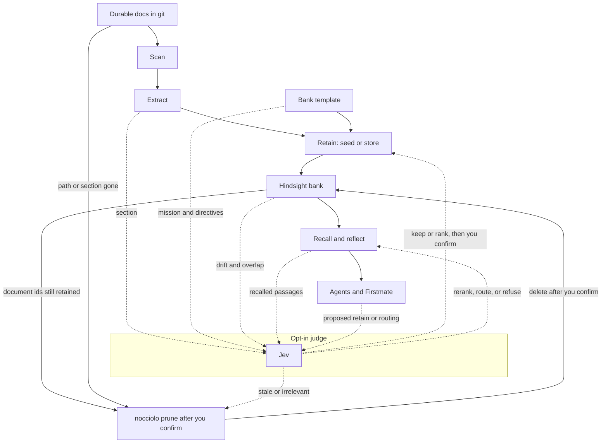

# Jev integration

[Jev](https://docs.typesafe.ai/introduction) (TypeSafe System One) is an opt-in judge for decisions Nocciolo still makes with heuristics. Nocciolo already scans a repo, hashes what it keeps, and retains that into a Hindsight bank. The open question is which of that work is worth retaining, what is stale, what should go first, and when a person should step in. Jev takes a small slice of that state and returns a typed answer with a confidence score. Nocciolo keeps the side effects.

This is planned work:

- [Phase 4](../ROADMAP.md) on the roadmap
- [JEV-0](https://github.com/zanuka/nocciolo/issues/58), the epic
- the open [`jev` issues](https://github.com/zanuka/nocciolo/issues?q=is%3Aissue+is%3Aopen+label%3Ajev)

## Why

**Spend retain on durable knowledge.** Hindsight retain is the expensive step. Heuristics already drop a lot of noise, and changelogs, tables of contents, and boilerplate still get through often enough to matter. Jev scores a section before that spend:

- whether it is relevant
- what kind of knowledge it is
- whether it contradicts observations already in the bank
- whether a later reader can cite it
- whether it carries a secret or personal data

The same pass can score the generated mission and directives, and can propose mental-model questions and tags. The wording stays in the template you commit. `seed --dry-run --judge jev` shows the keep, the skip, and the score.

**Put the durable part of a large diff first.** A monorepo change can touch dozens of markdown files and contain only a few decisions. Jev ranks those candidates against a retain budget, and it can:

- propose which new files belong on the `store` allowlist
- hold an edit that does not look durable

You confirm before anything is retained.

**Remove knowledge that is no longer true.** `seed` and `store` add or upsert. Months later a doc can be irrelevant, a path can be gone, or a section can contradict the current tree. `nocciolo prune` groups those cases and asks you to choose:

- source path no longer in the repo
- section no longer in the file
- a path or `document_id` you name
- with `--judge jev`, items scored as outdated, irrelevant, or contradicted, including when the file is still on disk

Jev annotates that prompt with a choice and a confidence score.
A low score is shown and left unchecked.
`--dry-run` prints the groups and does not delete.
After you confirm, Nocciolo invalidates or deletes the chosen documents and tombstones them so the next `seed` or `store` does not put the same unchanged text back.
A mental-model refresh can be recommended in the same run and is its own confirmation.
Path-gone and section-gone groups work with no TypeSafe key.

**Act only when the decision is still real.** At read time, Jev can:

- rerank recalled passages
- flag a memory the docs no longer support
- choose `reflect`, `recall`, or a mental model

An agent `retain` through MCP is checked before it lands in the project bank. For Firstmate, Jev answers:

- whether the task needs this bank
- which bank
- whether the outcome is a knowledge update, a pull request, or both

A low score goes to the captain instead of a silent apply.

**Leave the default path local.**

- With no `NOCCIOLO_TYPESAFE_API_KEY` and no `--judge jev`, the CLI behaves as it does today and makes no TypeSafe call.
- A golden-set judge can score the offline heuristics so that default keep/skip improves for runs that never enable Jev.
- A public or Cloud share still waits on a safety check in Nocciolo before anything is exposed.

## Where it sits

Solid arrows are actions Nocciolo owns.
`nocciolo prune` path-gone / section-gone / explicit delete is in the CLI.
The dotted Jev annotation into prune is planned and not shipped yet.
Dotted arrows exist only with `--judge jev`.
Jev never stores the bank and never writes the repo.
It returns a typed choice and a confidence score.
Nocciolo retains, refuses, reranks, or applies after that, and a low score waits for you.

Secrets and denylisted paths stop at scan.
They do not reach extract, Jev, or Hindsight.

## Boundary

- Hindsight remains the memory bank and the CLI default.
- Jev is a judge, reached with `--judge jev`.
- Missions, ADRs, MCP snippets, and mental-model prose stay in the repo.
- Secrets and denylisted paths stay on the machine.
- Retain, prune, and share stay in this CLI, behind the confidence gate.

How those decisions show up in bank setup is in [company brain config](./company-brain.md).
