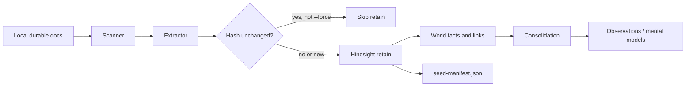

# Nocciolo sync strategy: retain vs file upload

Developer reference for why Nocciolo seeds Hindsight banks via **curated retain** instead of the common **markdown file-sync / upload** pattern.

Related: [README seeding section](../README.md#seeding-with-nocciolo-seed), [CLI architecture](./cli-architecture.md), [knowledge-base configs](./nocciolo-configs.md), [developer workflow](./dev-workflow.md).

---

## Two mental models

| File-sync / upload scripts | Nocciolo `seed` |
|----------------------------|-----------------|
| Treat the bank as a **document corpus** | Treat the bank as **agent memory** |
| Upload raw `.md` files (or chunks) | Extract high-signal sections locally, then **retain** via Hindsight’s memories API |
| Re-upload often re-processes the whole tree | Hash sources; skip unchanged files using `.nocciolo/local/seed-manifest.json` |
| File paths or opaque ids | Stable `document_id`s: `nocciolo:<relative-path>#<section-slug>` |
| Agent finds “the doc” | Agent **recalls** facts with provenance and **reflects** against observations |

Nocciolo aligns with how Hindsight is designed to work: **retain → recall → reflect**, plus background **consolidation** into observations and mental models. File upload treats Hindsight like a hosted folder of markdown: workable, but a weaker fit for coding agents that need queryable, linked knowledge.

There is **no separate `nocciolo sync` command**. When docs change, run `nocciolo seed` again (`--dry-run` first).

---

## Advantages of curated retain

### 1. Agent-native recall

Upload scripts store documents. Agents then search or skim files: similar to grep-with-embeddings over a static corpus.

Nocciolo retains **candidate facts** per section. Hindsight runs LLM extraction, builds entities and links, and later consolidates into observations and mental models. That matches MCP usage: agents call `recall` / `reflect` on structured memory, not “re-read the docs folder.”

Section-level ids (e.g. `nocciolo:README.md#core-principles`) make recall granular: agents pull the principle, not an entire README.

### 2. Less noise in the bank

Bulk upload ingests everything: changelogs, licenses, install boilerplate, empty stubs, generated tables of contents.

Nocciolo’s extractor is **conservative by design** ([AGENTS.md](../AGENTS.md)):

- Scores sections for signal (decisions, architecture, standards, domain rules)
- Skips common noise headings (changelog, TOC, getting started, etc.)
- Keeps whole ADRs and `AGENTS.md` as high-value single documents
- Ignores fenced code when parsing markdown headings

Better to miss a weak section than pollute the bank. Upload scripts have no equivalent gate unless you maintain custom filters.

### 3. Incremental updates

File-sync workflows often re-upload and re-embed the full tree on every run: slow and expensive at scale.

Nocciolo:

1. Scans all durable sources locally (cheap)
2. Computes a **SHA-256 content hash** per file
3. Compares to `.nocciolo/local/seed-manifest.json`
4. **Skips unchanged** sources unless `--force`
5. Retains only candidates from new or changed files

Re-runs after small doc edits are proportional to what changed, not repo size.

**Note:** Every `seed` still reads every durable file locally to compute hashes. Incremental savings are on the Hindsight **retain** side (LLM extraction per item), not local I/O.

### 4. Stable upserts, not duplicates

Each candidate gets a stable Hindsight `document_id` derived from project path and section slug. Re-retaining the same id **upserts** in Hindsight.

File uploads frequently create duplicate or orphaned versions unless the script implements careful dedup and tombstoning. Nocciolo’s id scheme is explicit and documented in [nocciolo-configs.md](./nocciolo-configs.md).

In-place edits: same path → same ids → upsert. No bank wipe.

### 5. Provenance agents can cite

Every retain item carries metadata:

- `source`: relative path in the repo
- `kind`: readme, agents, docs, adr
- `knowledge_kind`: decision, architecture, standard, domain, overview, …
- `commit`: optional `git rev-parse HEAD` when available
- `nocciolo_fact_id`: stable fact id matching `document_id`

Agents can answer “where did this come from?” and humans can verify against git. Raw file upload often loses structured provenance unless added manually.

### 6. Preview before polluting the bank

`nocciolo seed --dry-run`:

- Lists candidates that **would** be retained (with scores and excerpts)
- Lists **unchanged** sources that would be skipped
- Lists **empty / low-signal** sources that would be skipped
- Makes **no API calls** and does **not** write the seed manifest

Upload-first workflows discover noise only after it is already in the bank.

### 7. Separation of bank policy and project content

| Layer | What it is | Where it lives |
|-------|------------|----------------|
| Bank personality | Mission, directives, mental models, extraction policy | `.nocciolo/hindsight/bank-template.json` → imported into Hindsight |
| Project knowledge | Durable facts and decisions from the repo | Retained by `nocciolo seed` |

File-sync scripts often conflate “how the bank should behave” with “what the project knows.” Nocciolo keeps configure/template and seed as distinct stages ([cli-architecture.md](./cli-architecture.md)).

### 8. Security before retain

The scanner denies sensitive paths (`.env*`, keys, credentials, `secrets/`, etc.) **before** extraction. See [sensitive-data.md](./sensitive-data.md).

Upload scripts that glob `**/*.md` risk ingesting credential docs or env examples unless explicitly filtered.

### 9. Local-first, additive, predictable

- Hashing and extraction run locally; you control what gets sent
- Live `seed` is **additive**: it does not wipe the bank
- Incremental state is machine-local (gitignored); the shared memory is the Hindsight bank
- Errors are actionable (auth failures stop early; manifest tracks partial success)

---

## What `seed` does (pipeline)



1. **Scanner**: README.md, AGENTS.md, `docs/**`, ADRs (see `src/scanner/durable-sources.ts`)
2. **Extractor**: heuristic sections + scoring (`src/extractor/`)
3. **Seeder**: hash check, manifest, retain payload (`src/seeder/`)
4. **Hindsight client**: `POST …/banks/{bankId}/memories` with `timestamp: "unset"` for timeless reference docs
5. **Manifest**: `.nocciolo/local/seed-manifest.json` per source path: `contentHash`, `factIds`, `seededAt`

Implementation map: [cli-architecture.md](./cli-architecture.md#seeder-and-incremental-re-seed).

---

## Operational notes

### Re-seeding after doc changes

```bash
nocciolo seed --dry-run   # plan: retain vs skip
nocciolo seed             # incremental live retain
```

Unchanged sources (same content hash) are skipped. Use `--force` to re-retain all **current** candidates: still does not delete old memories.

### When incremental skip fails

If every source is retained again on a second run with no edits:

- `.nocciolo/local/seed-manifest.json` may be missing (first live seed, dry-run only, fresh clone, failed/interrupted seed)
- Manifest is **gitignored**: not shared across machines via git
- Invalid manifest JSON is ignored (treated as empty)
- `--force` disables skip

### Renames and deletes

- **Edit in place** → re-run `seed`; same ids → upsert
- **Rename or delete a file** → re-run `seed` for the new path; **old memories remain** under old ids (`nocciolo:docs/foo.md#…`)
- There is no `nocciolo prune` today: invalidate or delete stale documents in Hindsight (Control Plane or MCP) if duplicates matter

---

## Tradeoffs (honest limits)

| Benefit | Cost |
|---------|------|
| Structured, queryable memories | First seed is slower (LLM extraction **per candidate**, not one bulk upload) |
| Incremental re-seed | Manifest is per-machine unless you copy `.nocciolo/local/` |
| Conservative extraction | May miss edge content: intentional; expand docs or adjust extractors rather than “upload everything” |
| Additive upserts | Stale memories after rename/delete need manual cleanup in Hindsight |
| Section-level ids | Very large single files (non-ADR) are split by heading: ADRs and AGENTS.md stay whole-document |

---

## When file-sync might still make sense

- You need a **literal archive** of every markdown file in Hindsight for human browsing, not agent recall
- The corpus is small, rarely changes, and noise is acceptable
- You have custom upload tooling with dedup you already trust

For **coding agents inheriting project knowledge**, Nocciolo’s retain-first model is the intended path. Event-driven or watch-mode seed (roadmap) will still use this pipeline: not a parallel upload path.

---

## See also

- [nocciolo-configs.md](./nocciolo-configs.md): manifest shape and `document_id` examples
- [dev-workflow.md](./dev-workflow.md): day-to-day build → seed → Hindsight loop
- [dev-testing.md](./dev-testing.md): incremental re-seed regression checklist
- [sensitive-data.md](./sensitive-data.md): denylist before retain
